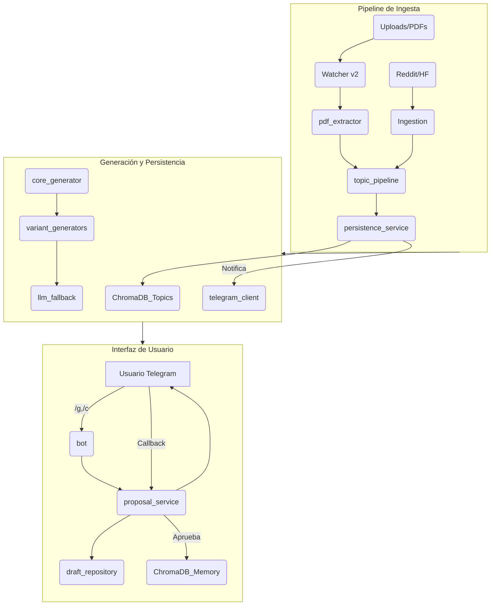

# 01 · Arquitectura (vista 10.000 ft)

La arquitectura define flujos e interacciones, no un listado de ficheros.

## Componentes
- Watcher v2 / run_watcher.py: observa `uploads/` y dispara extracción de temas.
- topic_pipeline: extracción/validación de temas; gating de estilo.
- persistence_service: inserta en Chroma y sincroniza remoto.
- core_generator: orquesta selección de tema y generación A/B/C.
- variant_generators: prompts y validadores de estilo/longitud.
- llm_fallback: capa LLM con JSON estricto y fallback entre proveedores.
- proposal_service: bot de propuestas, callbacks y memoria.
- telegram_client: envío seguro a Telegram (HTML, teclados, fallback).

